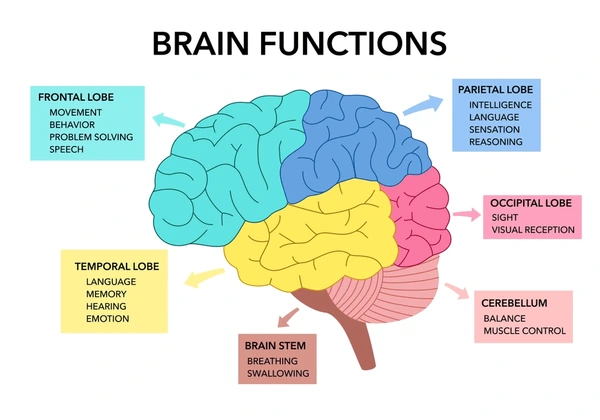

```{r, echo=FALSE}
knitr::opts_chunk$set(
  echo = TRUE,
  warning = FALSE,
  message = FALSE
)
```

# Project Overview: My Goals
This project was completed for Data Analysis for Biologists at Utah Valley University. I took this course to learn how to analyze genomic data using computational tools, and I wanted my final project to reflect that goal while also pushing myself to learn new skills.

For this project, I focused on:

- Using R packages to improve data visualization and interpretation.
- Learning new bioinformatic analysis methods.
- Exploring a topic I am interested in.

Based on these goals, I explored the following question:

How do gene expression patterns change across human brain developmental, and can distinct developmental stages can be identified based on these patterns?

Let's dive in!

# Introduction: Brain Basics
Genes are often associated with traits like eye color or inherited conditions, but their role goes much deeper- especially in the brain.

```{r, echo=FALSE, fig.align="center", out.width="700px", fig.cap="Figure 1. Overview of major brain regions."}

```


According to the National Institute of Neurological Disorders and Stroke (NINDS), although every cell in the body contains the same DNA, only certain genes are active in each cell. This process, known as gene expression, determines which protein are produced and ultimately how cells function. The brain expresses a large proportion of the human genome, highlighting its complexity and importance. [Understanding Gene Expression](https://www.ninds.nih.gov/health-information/patient-caregiver-education/brain-basics-genes-work-brain#:~:text=For%20the%20most%20part%2C%20every,the%20course%20it%20might%20follow)

As a biotechnology student, I've spent a lot of time studying DNA- extracting, analyzing, and manipulating it. However, I haven't haven't focused much on how gene expression specifically impacts brain development. Since the brain controls nearly every function in the body, understanding how gene expression changes over time can provide important insights into human development. This project explores those patterns.

# Background: BrainSpan Dataset
To answer my research question, I needed a dataset that captured gene expression across developmental time. After exploring several sources, I found the BrainSpan Atlas, which provides RNA sequencing data from human brain samples across a wide range of developmental stages. 

The BrainSpan dataset includes:
- Gene expression measurements across multiple brain regions.
- Samples ranging from early prenatal stages to adulthood.
- Expression values reported as RPKM (Reads per Kilobase per Million), which indicate how actively a gene is being transcribed.

This dataset is ideal for studying how gene expression changes over time and identifying patterns that may correspond to different stages of development.

Before analyzing the data, it needed to be cleaned and organized so that it could be easily interpreted and visualized.
```{r}
library(tidyverse)
library(pheatmap)
library(RColorBrewer)

# Load data
expression_data <- read.csv("Brain_Span_Data/expression_matrix.csv", row.names = 1)
rows_data <- read.csv("Brain_Span_Data/rows_metadata.csv")
columns_data <- read.csv("Brain_Span_Data/columns_metadata.csv")

# Align row metadata
rows_data <- rows_data[seq_len(nrow(expression_data)), ]

# Fix gene names
rownames(expression_data) <- make.unique(rows_data$gene_symbol)

# Fix sample names
columns_data$column_num <- as.character(columns_data$column_num)
colnames(expression_data) <- columns_data$column_num

# Align column metadata
columns_data <- columns_data %>%
  mutate(
    age_numeric = case_when(
      grepl("pcw", age) ~ as.numeric(gsub(" pcw", "", age)),
      grepl("mos", age) ~ as.numeric(gsub(" mos", "", age)) * 4.3,
      grepl("yrs", age) ~ as.numeric(gsub(" yrs", "", age)) * 52,
      TRUE ~ NA_real_
    )
  )

# Clean age variable
columns_data <- columns_data %>%
  mutate(age_numeric = as.numeric(gsub(" pcw", "", age)))
```

Now it's time to look at the data through graphs to try and understand how gene expression works in the brain.

# Results
## Heatmap Analysis
To start off, I created a heat map of the most variable genes across all samples. This allows us to identify groups of genes that behave similarly during development, and gain an overall look at the data.
```{r, echo=TRUE}
# Order by age
order_idx <- order(columns_data$age_numeric)

expr_ordered <- expression_data[, order_idx]
meta_ordered <- columns_data[order_idx, ]

# Top genes
top_genes <- expr_ordered %>%
  apply(1, var) %>%
  sort(decreasing = TRUE) %>%
  head(100) %>%
  names()

heatmap_data <- t(scale(t(expr_ordered[top_genes, ])))

annotation_col <- data.frame(Age = meta_ordered$age_numeric)
rownames(annotation_col) <- colnames(heatmap_data)

pheatmap(
  heatmap_data,
  show_rownames = FALSE,
  show_colnames = FALSE,
  cluster_cols = FALSE,
  annotation_col = annotation_col,
  color = colorRampPalette(rev(brewer.pal(9, "RdBu")))(100),
  main = "Gene Expression Patterns Across Development"
)
```

After clustering genes and ordering samples by developmental age, the heatmap reveals clear groups of genes with similar expression patterns. Some clusters show high expression early in development that decreases over time, while others show the opposite trend. These structured patterns suggest that gene expression during brain development occurs in coordinated phases, supporting the idea that distinct developmental stages can be identified based on gene activity.

## Principal Component Analysis
Understanding overall patterns in gene expression across development is important before focusing on individual genes. I explored this by performing a Principal Component Analysis (PCA), which reduces the complexity of the data set while keeping the major patterns of variation. This will help us see the big picture.
```{r, echo=TRUE}
expression_scaled <- expression_data %>%
  apply(1, sd) %>%
  {expression_data[. > 0, ]} %>%
  t() %>%
  scale()

pca <- prcomp(expression_scaled)

pca_df <- as.data.frame(pca$x) %>%
  rownames_to_column("Sample") %>%
  left_join(columns_data, by = c("Sample" = "column_num"))

var_explained <- summary(pca)$importance[2, 1:2]

ggplot(pca_df, aes(PC1, PC2, color = age_numeric)) +
  geom_point(size = 3) +
  scale_color_gradient(low = "hotpink", high = "steelblue") +
  labs(
    title = "PCA of Gene Expression Across Brain Development", 
    subtitle = "Samples show a continuous trajectory across developmental age",
    x = paste0("PC1 (", round(var_explained[1]*100, 1), "% variance explained)"),
    y = paste0("PC2 (", round(var_explained[2]*100, 1), "% variance explained)")
  ) +
  theme_minimal(base_size = 14)
```

The PCA plot shows a clear progression across developmental age, with samples gradually shifting position as age increases This suggests that gene expression changes systematically over time rather than randomly. 

Instead of forming distinct clusters, the samples follow a continuous trajectory, indicating that brain development is a gradual process rather than a set of sharply defined stages.

PC1 captures the majority of variation in the dataset and appears to correspond to developmental age, as samples are ordered along this axis.

## Time-Series Line Plot
Now that we've seen the overall big picture of the data, lets look at a couple of genes in this data set individually and see how they increase or decrease over time.
```{r, echo=TRUE}
# Select top variable genes
top_genes <- expression_data %>%
  apply(1, var) %>%
  sort(decreasing = TRUE) %>%
  head(6) %>%
  names()

expr_long <- expression_data[top_genes, ] %>%
  as.data.frame() %>%
  rownames_to_column("Gene") %>%
  pivot_longer(-Gene, names_to = "Sample", values_to = "Expression") %>%
  left_join(columns_data, by = c("Sample" = "column_num"))

ggplot(expr_long, aes(age_numeric, Expression, color = Gene)) +
  geom_line(linewidth = 1) +
  geom_point(size = 2) +
  labs(
    title = "Gene Expression Trends Over Developmental Time",
    x = "Developmental Age (Post-Conception Weeks)",
    y = "Expression Level (RPKM)"
  ) +
  facet_wrap(~Gene, scales = "free_y") +
  theme_minimal(base_size = 14)
```

The amount of expression that genes exhibit over time varies, but an overall trend can be seen: that gene expression increases over developmental time. Let's look into a few more genes more closely.

## Gene Trends
To better understand how individual genes behave across development, I examined the expression patterns of a few selected genes over time.
```{r, echo=TRUE}
genes_to_plot <- c("SOX2", "NEUROD6", "GAPDH")

expression_long <- expression_data[genes_to_plot, ] %>%
  as.data.frame() %>%
  rownames_to_column("Gene") %>%
  pivot_longer(-Gene, names_to = "Sample", values_to = "Expression") %>%
  left_join(columns_data, by = c("Sample" = "column_num"))

ggplot(expression_long, aes(age_numeric, Expression, color = Gene)) +
  geom_point(alpha = 0.7) +
  geom_smooth(se = FALSE, linewidth = 1) +
  labs(
    title = "Expression Patterns Across Development",
    x = "Developmental Age (Post-Conception Weeks)",
    y = "Expression Level (RPKM)"
  ) +
  theme_minimal(base_size = 14)
```

The selected genes show distinct expression patterns across development. For example:

- Some genes decrease in expression over time, suggesting they play a role in early brain development.
- Others increase in expression as development progresses, indicating involvement in later stages.
- Some genes remain relatively stable across time.

These patterns highlight the dynamic nature of gene regulation in the developing brain and support the idea that different genes are active at different stages of development.

## Developmental Comparison
To further investigate differences in gene expression across development, I divided samples into early and late developmental stages based on age. I then performed statistical tests to identify genes that are significantly different between these two groups.
```{r, echo=TRUE}
columns_data <- columns_data %>%
  mutate(stage = ifelse(age_numeric < 15, "Early", "Late"))

early_idx <- columns_data$stage == "Early"
late_idx  <- columns_data$stage == "Late"

p_adj <- apply(expression_data, 1, function(gene) {
  t.test(gene[early_idx], gene[late_idx])$p.value
}) %>%
  p.adjust(method = "fdr")

results_df <- data.frame(
  gene = rownames(expression_data),
  p_adj = p_adj
) %>%
  arrange(p_adj)

top_sig_genes <- results_df %>%
  slice_head(n = 10) %>%
  pull(gene)

expression_long_sig <- expression_data[top_sig_genes, ] %>%
  as.data.frame() %>%
  rownames_to_column("Gene") %>%
  pivot_longer(-Gene, names_to = "Sample", values_to = "Expression") %>%
  left_join(columns_data, by = c("Sample" = "column_num"))

ggplot(expression_long_sig, aes(stage, Expression, fill = stage)) +
  geom_boxplot() +
  facet_wrap(~Gene, scales = "free") +
  labs(
    title = "Differential Gene Expression Between Early and Late Development",
    x = "Developmental Stage",
    y = "Expression Level (RPKM)"
  ) +
  theme_minimal(base_size = 14)
```

The results of these box plots show that gene expression is more active in early development as opposed to late development. This is consistent with biological signals. Early brain development means that there's a lot of gene activity to help with growth.

## Volcano Plot
Now let's look at a scatter plot to quickly identify if there are any significant changes in this dataset.
```{r}
# Get sample names for each group
early_samples <- columns_data$column_num[columns_data$stage == "Early"]
late_samples  <- columns_data$column_num[columns_data$stage == "Late"]

# Make sure they exist in expression_data
early_samples <- intersect(early_samples, colnames(expression_data))
late_samples  <- intersect(late_samples, colnames(expression_data))

results_df <- apply(expression_data, 1, function(gene) {

  early_vals <- gene[colnames(expression_data) %in% early_samples]
  late_vals  <- gene[colnames(expression_data) %in% late_samples]

# Remove NA
  early_vals <- early_vals[!is.na(early_vals)]
  late_vals  <- late_vals[!is.na(late_vals)]

  if(length(early_vals) < 2 | length(late_vals) < 2) {
    return(c(logFC = NA, p_value = NA))
  }

  test <- t.test(early_vals, late_vals)

  c(
    logFC = mean(early_vals) - mean(late_vals),
    p_value = test$p.value
  )
}) %>%
  t() %>%
  as.data.frame()

results_df$gene <- rownames(results_df)

results_df <- results_df %>%
  mutate(
    logFC = as.numeric(logFC),
    p_adj = p.adjust(as.numeric(p_value), method = "fdr")
  ) %>%
  filter(!is.na(logFC), !is.na(p_adj), p_adj > 0)

ggplot(results_df, aes(logFC, -log10(p_adj))) +
  geom_point(alpha = 0.5) +
  geom_vline(xintercept = 0, linetype = "dashed") +
  coord_cartesian(xlim = c(-50, 50)) +
  theme_minimal(base_size = 14) +
  labs(
  title = "Volcano Plot of Differential Gene Expression",
  x = "Log2 Fold Change",
  y = "-Log10 Adjusted P-value")
```

The volcano plot shows that most genes have log fold changes near zero, indicating minimal differences in expression between early and late developmental stages. While some genes are statistically significant, the magnitude of these changes are generally small. 

This suggests that gene expression during brain development changes gradually over time rather than through abrupt shifts between discrete stages. These results are consistent with the PCA analysis, which also indicated a continuous developmental trajectory.

# Discussion
The data shows that gene expression in the human brain changes continuously over development. Heat maps revealed groups of genes with similar patterns, some active early and others later, reflecting the coordinated processes of growth and maturation. PCA confirmed this gradual shift, with PC1 closely aligned with age, suggesting that brain development is a smooth, continuous process rather than distinct stages.

Individual genes like SOX2, NEUROD6, and GAPDH displayed diverse trends, with some decreasing, increasing, or staying the stable over time. Comparing early and late highlighted statistical differences, but overall, changes were subtle, supporting a model of gradual transcriptional transitions.

Limitations to the data include a small sample size at each age and bulk RNA-sequence averages across cells types, which could mask cell specific patterns. 

# Conclusion
Human brain development is a carefully coordinated process, with genes turning on and off at the right times to guide growth, differentiation, and maturation. These changes happen gradually, not in sudden jumps, which matches what we saw in the analyses.

This project shows how computational tools like heat maps, PCA, and time-series plots can help make sense of complex gene expression data. Studying these patterns gives us a window into the brain’s development and helps us understand the biological choreography behind it. It’s fascinating to see just how organized and dynamic the process really is.